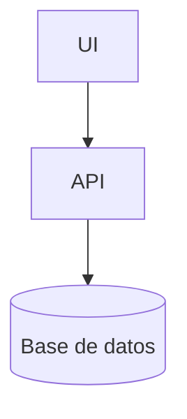

<!--
Este documento es un ejemplo minimo compatible con el CLI.
-->

# Informe de ejemplo

## Introduccion

Este informe demuestra:

- Figura Mermaid con caption arriba + fuente abajo
- Tabla simple con caption arriba + fuente abajo
- Referencias cruzadas nativas (@fig / @tab)
- Cita Word nativa [@ONU16]

Como se muestra en @fig:arquitectura, el flujo de datos se organiza por etapas.

Tambien se incluye una imagen local (ver @fig:logo).

## Arquitectura

<!--figure id=arquitectura title="Arquitectura del backend" source="Elaboracion propia"-->

<!--figure id=logo title="Logo de ejemplo" source="Elaboracion propia"-->

## Stack tecnologico

<!--table id=stack title="Stack tecnologico" source="Elaboracion propia"-->
| Componente | Tecnologia |
|---|---|
| API | Django REST |
| BD  | PostgreSQL |
| Cache | Redis |

Ver @tab:stack para el detalle del stack.

## Cierre

Segun [@ONU16], la transformacion urbana requiere un marco de gobernanza y financiamiento.
