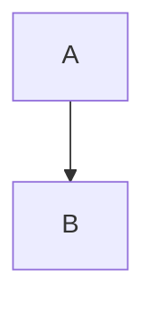

# Esquema Markdown (Word Formato_GIRS)

Este esquema permite:

- Render agradable en GitHub (GFM)
- Conversion a Word con captions/numeracion/listas/refs/citas nativas

## 1. Metadata (recomendado)

En vez de YAML front matter (que GitHub muestra), usar `meta.yaml`:

```yaml
title: "TITULO DEL DOCUMENTO"
subtitle: "Subtitulo del documento"
author: "Nombre Apellido"
date: "2026-01-28"
lang: "es-EC"
```

## 2. Headings (niveles 1-4)

```md
# Titulo 1
## Titulo 2
### Titulo 3
#### Titulo 4
```

Se mapean a estilos de la plantilla (Heading1-Heading4).

## 3. Figuras

Regla: cada figura que deba numerarse y entrar en la lista debe declararse con directiva `<!--figure ...-->`.

### 3.1 Figura con Mermaid

```md
<!--figure id=arquitectura title="Arquitectura del backend" source="Elaboracion propia"-->

```

El CLI renderiza Mermaid a PNG (fondo transparente) e inserta:

- Caption arriba: `Figura {SEQ Figura}. <titulo>` (estilo Caption)
- Imagen
- Fuente abajo: `Fuente: ...` (estilo Normal)

### 3.2 Figura con imagen local

```md
<!--figure id=mapa title="Mapa de cobertura" source="Institucion X (2024)"-->

```

## 4. Tablas

Regla: cada tabla que deba numerarse y entrar en la lista debe declararse con directiva `<!--table ...-->`.

```md
<!--table id=stack title="Stack tecnologico" source="Elaboracion propia"-->
| Componente | Tecnologia |
|---|---|
| API | Django REST |
| BD  | PostgreSQL |
```

Salida:

- Caption arriba: `Tabla {SEQ Tabla}. <titulo>` (estilo Caption)
- Tabla
- Fuente abajo

## 5. Referencias cruzadas

En texto, usa tokens:

- `@fig:<id>` para una figura
- `@tab:<id>` para una tabla

Ejemplo:

```md
Como se muestra en @fig:arquitectura, el flujo...
Ver @tab:stack para el stack.
```

El CLI los convierte a campos `REF` nativos.

## 6. Citas y bibliografia (Word nativo)

En el Markdown, usa citas tipo Pandoc:

```md
Segun [@ONU16], ...
```

Y define las fuentes en `references/sources.yaml`.

Notas:

- El estilo APA es el que trae la plantilla Word.
- La bibliografia se genera con el campo `BIBLIOGRAPHY` ya incluido en la plantilla.
