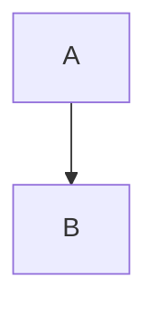

# Esquema Markdown (Word Formato_GIRS)

Este esquema permite:

- Render agradable en GitHub (GFM)
- Conversión a Word con captions/numeración/listas/refs/citas nativas

## 1. Metadata (recomendado)

En vez de YAML front matter (que GitHub muestra), usar un archivo `meta.yaml`:

```yaml
title: "TÍTULO DEL DOCUMENTO"
subtitle: "Subtítulo del documento"
author: "Nombre Apellido"
date: "2026-01-28"
lang: "es-EC"
```

## 2. Headings (niveles 1-4)

```md
# Título 1
## Título 2
### Título 3
#### Título 4
```

Se mapean a estilos de la plantilla (Heading1-Heading4).

## 3. Figuras

Regla: cada figura que deba numerarse y entrar en la lista debe declararse con directiva `<!--figure ...-->`.

### 3.1 Figura con Mermaid

```md
<!--figure id=arquitectura title="Arquitectura del backend" source="Elaboración propia"-->

```

El CLI renderiza Mermaid a PNG (fondo transparente) e inserta:

- Caption arriba: `Figura {SEQ Figura}. <título>` (estilo Caption)
- Imagen
- Fuente abajo: `Fuente: ...` (estilo Normal)

### 3.2 Figura con imagen local

```md
<!--figure id=mapa title="Mapa de cobertura" source="Institución X (2024)"-->

```

### 3.3 Figura con snippet de código

```md
<!--figure id=snippet-ejemplo title="Ejemplo TypeScript: useTerritorialContext()" source="Elaboración propia"-->
```typescript
export const useTerritorialContext = () => {
  // ...
}
```
```

El CLI renderiza el snippet a PNG con resaltado por lenguaje y números de línea.

## 4. Tablas

Regla: cada tabla que deba numerarse y entrar en la lista debe declararse con directiva `<!--table ...-->`.

```md
<!--table id=stack title="Stack tecnológico" source="Elaboración propia"-->
| Componente | Tecnología |
|---|---|
| API | Django REST |
| BD  | PostgreSQL |
```

Salida:

- Caption arriba: `Tabla {SEQ Tabla}. <título>` (estilo Caption)
- Tabla
- Fuente abajo

## 5. Referencias cruzadas

En texto, usa tokens:

- `@fig:<id>` para una figura
- `@tab:<id>` para una tabla

Ejemplo:

```md
Como se muestra en @fig:arquitectura, el flujo...
Ver @tab:stack para el stack.
```

El CLI los convierte a campos `REF` nativos.

## 6. Citas y bibliografía (Word nativo)

En el Markdown, usa citas tipo Pandoc (soporta múltiples en un mismo bloque):

```md
Según [@ONU16], ...
Ver también [@ONU16; @OWASP2021] y [-@OWASP2021].
```

Y define las fuentes en el archivo que pases con `--sources`
(ejemplo: `examples/example-report/sources.yaml`).

Notas:

- El estilo APA es el que trae la plantilla Word.
- La bibliografía se genera con el campo `BIBLIOGRAPHY` ya incluido en la plantilla.

Recomendación:

- No escribas una sección final titulada "Referencias" en el Markdown. La plantilla ya incluye la sección "Referencias" + bibliografía automática.
