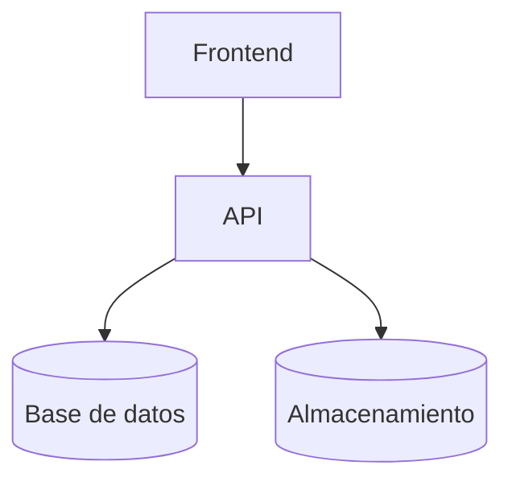

<!--
Este documento es un ejemplo completo compatible con el CLI.
-->

# 1. Introducción

Este informe muestra todos los componentes soportados por `md2docx`:

- Mermaid
- Imagen local
- Tabla simple
- Referencias cruzadas (@fig y @tab)
- Citas APA (Word)

En línea con [@MMAyA2024; @OWASP2021], se establecen criterios base para seguridad y documentación.

## 1.1 Contexto

### 1.1.1 Alcance

El objetivo es demostrar la estructura mínima requerida para generar DOCX con campos nativos.

# 2. Figuras

Como se muestra en @fig:arquitectura-backend, el flujo de datos sigue etapas claras.
También se incluye una imagen local (ver @fig:logo-sigir).

## 2.1 Arquitectura

<!--figure id=arquitectura-backend title="Arquitectura del backend" source="Elaboración propia"-->

## 2.2 Identidad visual

<!--figure id=logo-sigir title="Logo de ejemplo" source="Elaboración propia"-->

# 3. Tablas

<!--table id=stack-tec title="Stack tecnológico" source="Elaboración propia"-->
| Componente | Tecnología |
|---|---|
| API | Django REST |
| BD | PostgreSQL |
| Cache | Redis |
| Infra | Docker + Nginx |

Ver @tab:stack-tec para el detalle del stack.

# 4. Citas

Las prácticas recomendadas se resumen en [@OWASP2021].
El marco institucional se documenta en [@MMAyA2024].
